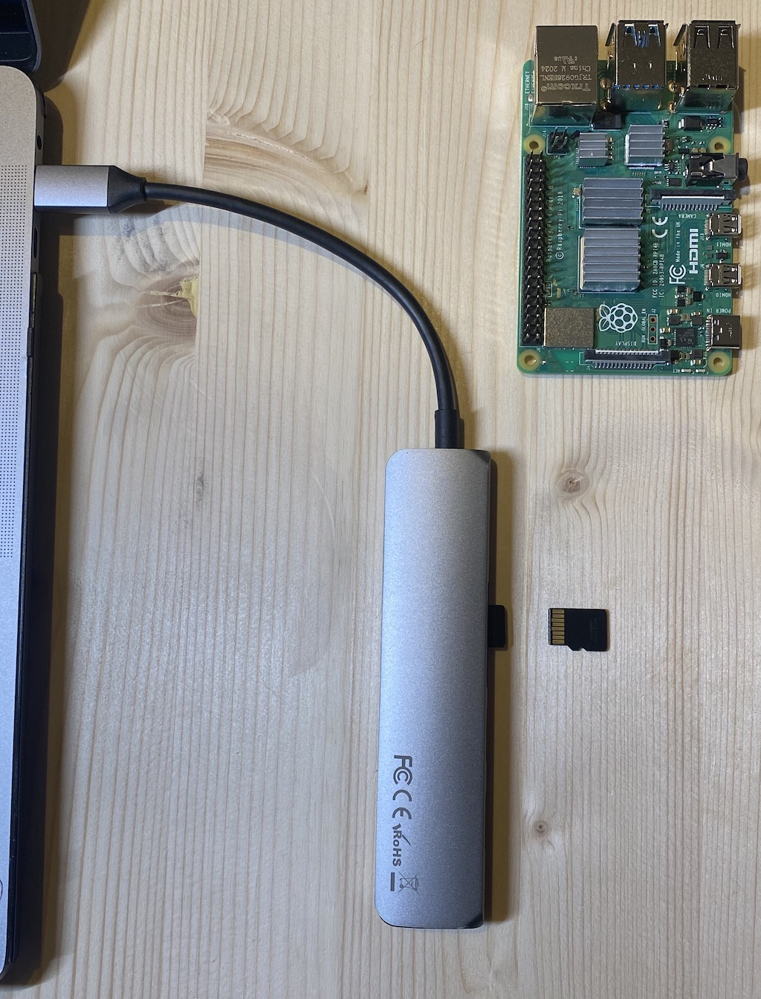

# Running a dockeri'zed full node on a Raspberry Pi 4

In this guide we'll learn:

- How to install a Raspberry Pi 4
- How to run a docker'ized instance of Alephium full node

## How to install a Raspberry Pi 4

This first section will detail my personal way of installing Ubuntu 20.04 server on a Raspberry Pi 4.
It requires to have a Raspberry Pi 4 (obviously), a SD Card (8 GB is the minimum) and an SD Card reader to flash the SD Card.
It will be illustrated using shell command from macOS, but you'll find the equivalent in Windows.



First of all we will configure the installation Ubuntu. We're using cloud-init for that since it is built in Ubuntu 20.04 and above.
This configuration creates a user (different from the `ubuntu` default) and installs a few packages.

### Configure the boot

Put the snippet below in a file named `user-data.yml` and save it. This one creates a user `alephium` with the password `installfest2021`.
You can customize the content of this file if you know what you're doing.

```yaml
#cloud-config

hostname: alephium

ssh_pwauth: true

users:
  - name: alephium
    gecos: "alephium"
    sudo: ALL=(ALL) NOPASSWD:ALL
    shell: /bin/bash
    groups: adm,sudo,docker
    plain_text_passwd: installfest2021
    lock_passwd: false
    chpasswd: { expire: false }
#    ssh_authorized_keys: # Optionally ad ssh key here, if you don't want the password.
#      - ssh-ed25519 xxxxxxxxxxxxxxxxxx

packages:
  - apt-transport-https
  - ca-certificates
  - curl
  - gnupg-agent
  - software-properties-common
  - git
  - openssh-server
  - docker.io
  - docker-compose

runcmd:
  - systemctl start docker
  - systemctl enable docker

package_update: true
package_upgrade: true

power_state:
  mode: reboot
```

### Flash the SD Card

Now, we'll flash the SD Card including this file `user-data.yml`.

I'm using the tool [flash](https://github.com/hypriot/flash/) for this, which does most of the hard work for you.

```shell
curl -LO https://github.com/hypriot/flash/releases/download/2.7.2/flash
chmod +x flash

./flash --userdata user-data.yml https://cdimage.ubuntu.com/releases/20.04/release/ubuntu-20.04.3-preinstalled-server-arm64+raspi.img.xz
```

The command above will ask for confirmation that `/dev/disk2` is the SD Card and not your harddrive, and will ask your password
because flashing a SD Card requires admin privileges.

Once the command above completes, you can insert the SD Card in your Raspberry Pi and turn it on.
It takes a handful of minutes for the first boot to execute fully, and your Raspberry Pi is ready to be used.
Once the node is ready, you can ssh into it using `alephium` as username, and `installfest2021` as password!

```shell
ssh alephium@alephium
```

If `alephium` host is unknown, you'll have to search for the IP address of the node, most likely on your router configuration app/page.

And that's it, your Raspberry Pi is running Ubuntu 20.04 with Docker, and is ready to run an Alephium full node.

🚀


## How to run a docker'ized instance of Alephium full node

This second section is not specific to a Raspberry Pi, but can be generalized to any server/vm/computer with SSH access.
We will run the most basic version of a Alephium full node using docker, and then iterate to make our setup more
convenient to work with.

As a pre-requisite of this section, we must have a server with SSH access, and more precisely running Ubuntu 20.04 or more recent.
The previous section explains how to do that with a Raspberry Pi, but an AWS EC2 instance would also do the job.

### Connect to the server

This should be an easy step, using the `ssh` command. Run:

```shell
ssh alephium@alephium
```

### Installing docker and docker-compose

Let's install docker and docker-compose quickly, so that we'll be all set to run the Alephium full node.

Once ssh'ed, run the following commands:

```shell
sudo apt install -y docker.io docker-compose
```

Great, docker should be running:

```shell
docker ps
```

### Run the full node

Now we can run the full node, in a single line, as follow:

```shell
docker run -it --rm -p 12973:12973 --name alephium alephium/alephium:v1.1.4
```

### Docker-compose

Docker-compose is a bit more convenient way of running a container, especially if the command starts to contain
volumes, more ports, environment variables, etc...

So, below is the service definition you can put in a `docker-compose.yml` file, and simply call `docker-compose up -d` to
start your full node from this definition.

```yaml
version: "3"
services:
  broker:
    image: "alephium/alephium:v1.1.4"
    restart: unless-stopped
    ports:
      - 9973:9973/tcp
      - 9973:9973/udp
      - 10973:10973/tcp
      - 12973:12973/tcp
```
